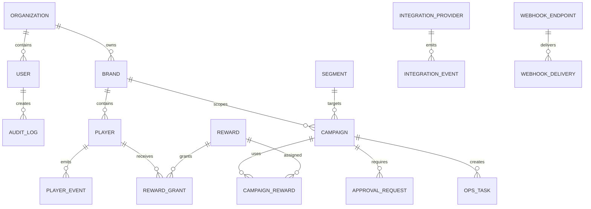

# Data Model Draft

This draft lists the main backend entities implied by the MonoPulse backoffice prototype. It should be reviewed with backend, product owner, and compliance before schema implementation.

## Entity Map



## Organization

Represents the operator group.

Key fields:

```text
id
name
status
defaultCurrency
timezone
createdAt
updatedAt
```

## Brand

Represents a casino/operator brand under the organization.

Key fields:

```text
id
organizationId
name
code
jurisdiction
currency
timezone
environmentStatus
integrationStatus
rewardReadiness
createdAt
updatedAt
```

## User

Backoffice user with org-level and brand-scoped permissions.

Key fields:

```text
id
organizationId
email
name
role
status
brandIds
twoFactorEnabled
lastLoginAt
createdAt
updatedAt
```

Suggested roles:

```text
crm_retention_manager
casino_manager
risk_manager
compliance_manager
technical_admin
operator_owner
viewer
```

## Player

Operator player profile visible to permitted users.

Key fields:

```text
id
platformPlayerId
brandId
alias
jurisdiction
currency
status
tierId
riskState
kycState
responsibleGamingState
lifetimeValue
rewardCost
cashbackLiability
lastActivityAt
createdAt
updatedAt
```

## Segment

Reusable audience definition.

Key fields:

```text
id
organizationId
name
type
ownerRole
brandIds
ruleJson
status
health
audienceCount
suppressedCount
lastCalculatedAt
createdAt
updatedAt
```

Segment types:

```text
dynamic
static
suppression
vip_managed
```

## Campaign

Core gamification object.

Key fields:

```text
id
organizationId
name
type
status
ownerId
brandIds
segmentId
startsAt
endsAt
timezone
budgetJson
riskControlsJson
mechanicConfigJson
approvalState
validationState
createdAt
updatedAt
```

Campaign types:

```text
mission
tournament
leaderboard
cashback
rakeback
prize_drop
raffle
jackpot
achievement
```

Campaign states:

```text
draft
ready_for_review
approved
scheduled
active
paused
completed
blocked
cancelled
rejected
```

## Reward

Catalog item that can be assigned to campaigns or granted manually.

Key fields:

```text
id
organizationId
name
type
brandIds
currency
value
fulfillmentMethod
bonusGuid
walletEndpointRef
status
riskState
liabilityCap
createdAt
updatedAt
```

Reward types:

```text
free_spins
bonus
cash
points
physical
vip_package
jackpot_payout
```

Fulfillment methods:

```text
operator_wallet
bonus_guid
monopulse_trigger
manual_ops
```

## RewardGrant

Specific reward delivery attempt to a player.

Key fields:

```text
id
rewardId
playerId
campaignId
brandId
state
fulfillmentMethod
externalReference
attemptCount
failureReason
grantedBy
grantedAt
createdAt
updatedAt
```

States:

```text
queued
granted
failed
retrying
cancelled
blocked
```

## LoyaltyProgram and Tier

Loyalty setup per brand or brand group.

Key fields:

```text
loyaltyProgram.id
loyaltyProgram.name
loyaltyProgram.brandIds
loyaltyProgram.status
loyaltyProgram.rulesJson

tier.id
tier.programId
tier.name
tier.rank
tier.entryCriteriaJson
tier.benefitsJson
tier.colorToken
```

## ApprovalRequest

Review workflow for campaigns, rewards, risky actions, and tier changes.

Key fields:

```text
id
objectType
objectId
state
submittedBy
assignedRole
assignedUserId
changedFieldsJson
blockersJson
decisionReason
submittedAt
decidedAt
createdAt
updatedAt
```

States:

```text
pending
approved
rejected
changes_requested
expired
revoked
blocked
```

## IntegrationProvider

External system connected to MonoPulse.

Key fields:

```text
id
brandId
providerName
kind
environment
status
authMode
lastSyncAt
incidentSummary
configJson
```

Kinds:

```text
casino
sportsbook
wallet
bonus_engine
operator_platform
identity
```

## IntegrationEvent

Inbound event from an operator or provider.

Key fields:

```text
id
idempotencyKey
brandId
environment
eventType
source
playerId
payloadJson
status
validationResult
latencyMs
receivedAt
processedAt
retryCount
```

Statuses:

```text
received
delivered
processed
retrying
failed
quarantined
ignored_duplicate
```

## WebhookEndpoint and Delivery

Outbound webhook config and delivery attempts.

Key fields:

```text
webhookEndpoint.id
webhookEndpoint.brandId
webhookEndpoint.environment
webhookEndpoint.url
webhookEndpoint.events
webhookEndpoint.signingSecretRef
webhookEndpoint.status

webhookDelivery.id
webhookDelivery.webhookEndpointId
webhookDelivery.eventId
webhookDelivery.status
webhookDelivery.httpStatus
webhookDelivery.attemptCount
webhookDelivery.lastAttemptAt
webhookDelivery.nextRetryAt
```

## OpsTask

Campaign operations task, similar to Jira.

Key fields:

```text
id
objectType
objectId
title
status
priority
ownerId
dueAt
brandIds
blockerReason
createdAt
updatedAt
```

## Report

Generated operational report.

Key fields:

```text
id
templateId
name
scopeJson
format
status
generatedBy
generatedAt
downloadUrl
recipients
```

## AuditLog

Immutable action record.

Key fields:

```text
id
organizationId
brandId
actorId
action
objectType
objectId
beforeJson
afterJson
reason
ipAddress
userAgent
createdAt
```

Audit log should be append-only. Any correction should create a new audit event, not edit an existing one.
